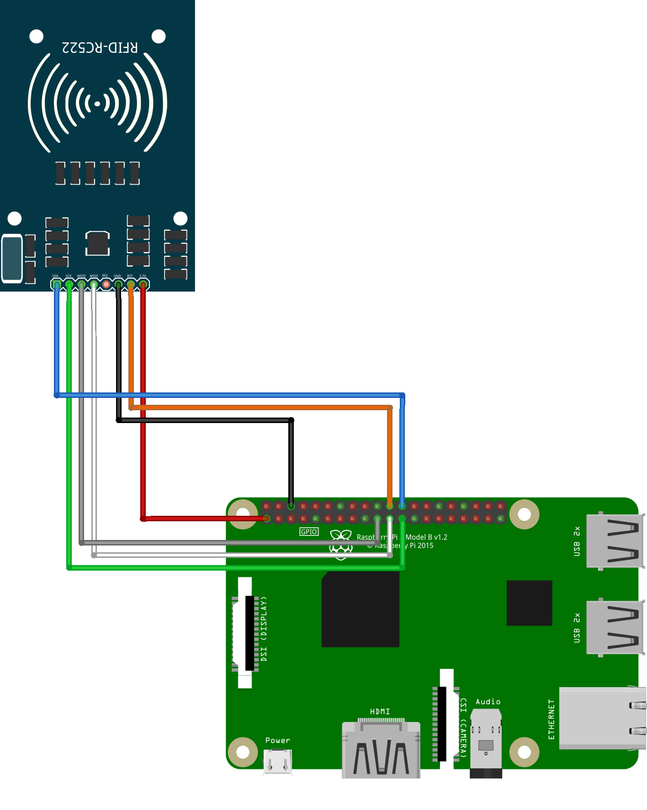

# Euterpe API

Euterpe is a random and useless but fun project which aims to provide a simple NFC reader  triggering Spotify songs.


# Setup

## Spotify

* Create an `Euterpe` app on [Spotify](https://developer.spotify.com/)
* Get spotify `CLIENT_ID` and `CLIENT_SECRET`

## Configure Raspberry

### Prerequisites

You must:
- Have a Raspberry Pi setup and configured to be accessible through ssh under `raspberry` with a sudoer user
- A RC522 card connected on the Raspberry
- Ensure it's connected to a speaker

### RC522 setup

Here is a wiring plan of the RC522 card on your Raspberry

### Install Raspotify

* Installation
```
> cd ansible
> ansible-playbook -i inventory/realm euterpe.yml --diff
```

# Run it!

* Start the API
```
> uvicorn euterpe.api:app --reload
```
* Run the server
```
> python euterpe/cli.py server run
```
